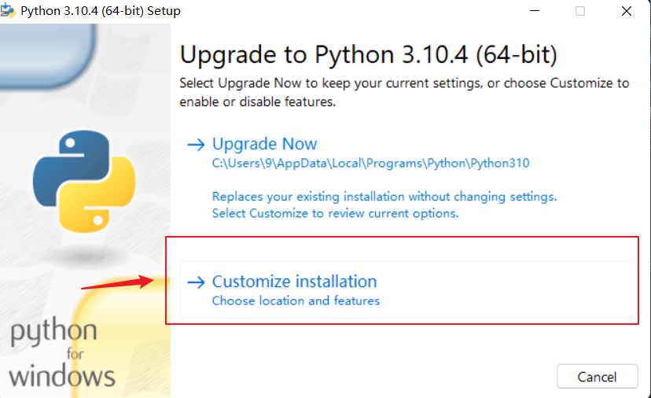

# vscode 搭建开发 python

## 配置 Windows 环境(win11)

进入[官网](https://www.python.org/downloads/windows/)下载 python windows installer

_windows installer_

### 安装

点开刚刚安装好的 python-3.10.4-amd64.exe 双击安装




### 验证是否安装成功

## Windows11 在终端输入 python 打开微软自带应用商店解决方案

Win11 开始菜单搜索【管理应用执行别名】关闭下面两个按钮【应用安装程序】，如下图：


## 使用 scoop 安装 python3

```powershell
scoop install python
```

### pip 使用国内镜像

```powershell
pip config set global.index-url https://pypi.tuna.tsinghua.edu.cn/simple
```


**注意:**

- 安装更新插件时候,请关闭 clashX

### vscode 配置 python.exe 路径

加入 setting.json

```json
  "python.defaultInterpreterPath": "C:\\Users\\9\\scoop\\shims\\python3.exe"
```

## 下载插件

- python
