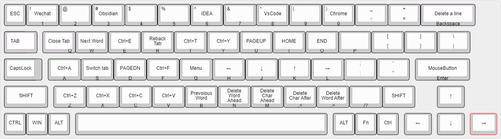

# vscodevim 快捷键

vscodevim 这个插件能够让你在 vscode 中实现 vim，这是我最喜欢的插件。

## autohotkey 改建

下面是我自己定义的键位图

**定义键位图网站**
[keyboard-layout](http://www.keyboard-layout-editor.com/#/gists/64d34ea30c1220a7c7aec8517bc05200)
