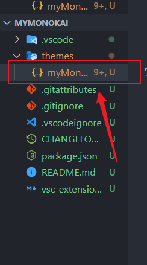

# vscode 开发主题插件

## vscode 插件安装地址

| 操作系统 | 安装路径                         |
| -------- | -------------------------------- |
| windows  | %USERPROFILE%\.vscode\extensions |
| macOs    | ~/.vscode/extensions             |
| Linux    | ~/.vscode/extensions             |

> %USERPROFILE% =C:\Users\用户名

## 下载 vscode 插件开发工具

```sh
npm install -g yo generator-code
```

通过命令生成主题文件

```sh
yo code
```

下面进入互动式安装过程，一步一步引导你完成一个主题模板的创建。


## 文件目录格式

最后生成一个以主题命名的目录,再命令行中会提醒你用 vscode 打开。
文件目录格式:


## 配置主题

在这个 json 文件内配置
可以通过 debug 实时预览我写的新主题样式。

### 参考资料

- [vscode theme color reference](https://code.visualstudio.com/api/references/theme-color)
- [Get color palettes from an image](https://hexcolor.co/image-to-colors)
- [Find color themes at](https://coolors.co/)

## 将做好的主题发布到 vscode 插件市场

 先下载 vsce.

```sh
npm install -g vsce
```

获得 token
   [bilibili 获得 token](https://www.bilibili.com/video/BV1jJ411h7go?p=1&share_medium=android&share_plat=android&share_source=COPY&share_tag=s_i&timestamp=1594029913&unique_k=4dAzWE)

命令行交互

创造插件开发者
进入这个[链接](https://aka.ms/vscode-create-publisher)然后填写 name 和 id

登录

```sh
vsce login Leiyi548
```

这个 Leiyi548 是我刚刚创建的 id 名,用户名

```sh
vsce package
vsce publish
```

### 问题解决

**Error: Make sure to edit the README.md file before you publish your extension.**
需要你将 README.md 重新删除掉,然后写入自己这个主题的特性。

### 参考链接

- [Publishing Extensions](https://code.visualstudio.com/api/working-with-extensions/publishing-extension)

## 参考

- [How to make your own VS Code theme!](https://www.youtube.com/watch?v=pGzssFNtWXw)
- [creating-a-vs-code-theme](https://css-tricks.com/creating-a-vs-code-theme/)
- [Publishing Extensions](https://code.visualstudio.com/api/working-with-extensions/publishing-extension)
- [bilibili 获得 token](https://www.bilibili.com/video/BV1jJ411h7go?p=1&share_medium=android&share_plat=android&share_source=COPY&share_tag=s_i&timestamp=1594029913&unique_k=4dAzWE)
